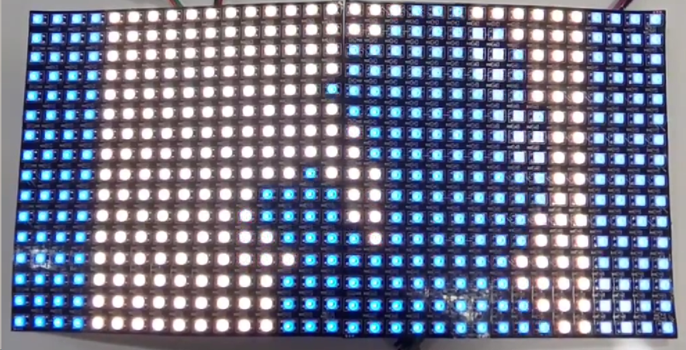
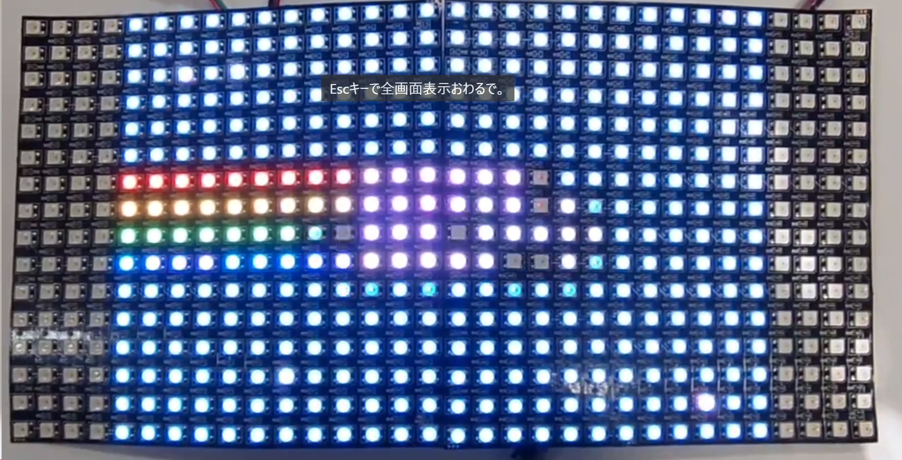

# 2枚のM-16382を使って動画を表示させる

環境：raspberrypi 3

## インストール

以下のコマンドで必要なライブラリをインストールできます。

```bash
pip install adafruit-circuitpython-neopixel
```

## 使用例
動画をテキストファイルに変換する
```bash
python mov2color3216.py your_movie.mp4 input.txt
```

32*16のLEDで動画を表示する
```bash
python light3216_color.py input.txt
```



